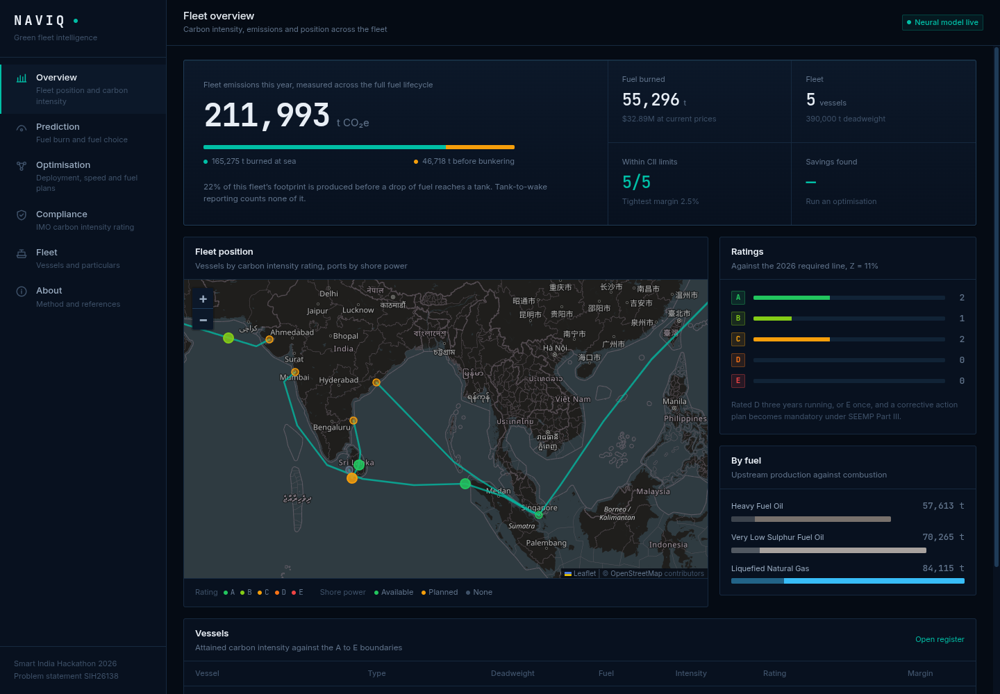
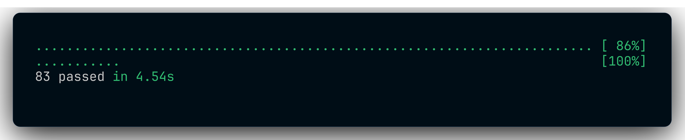
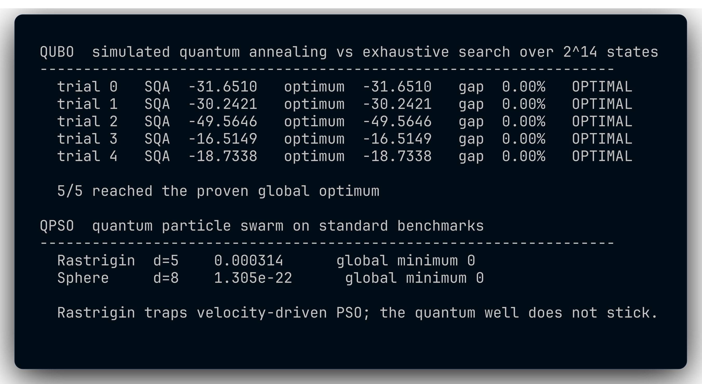
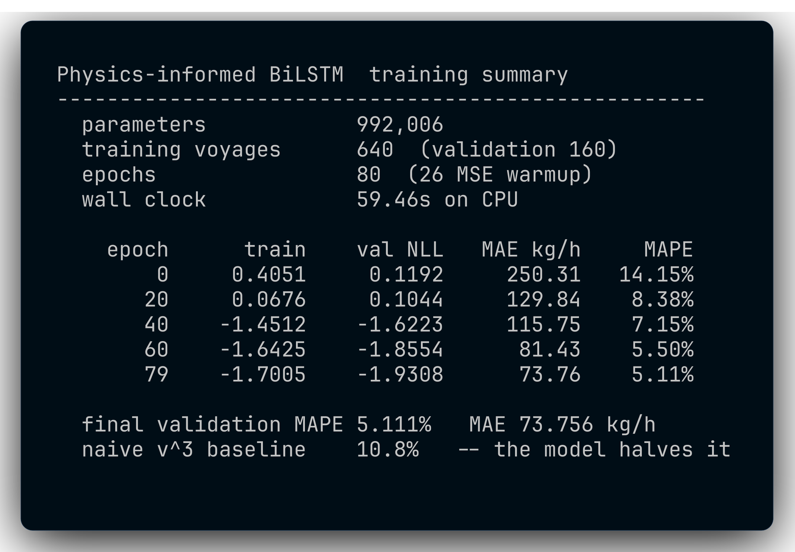
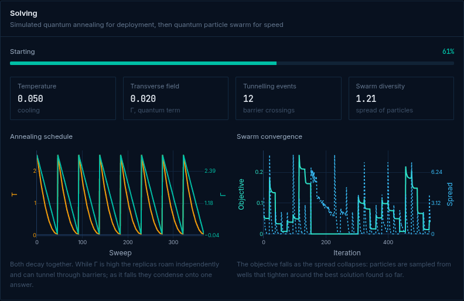
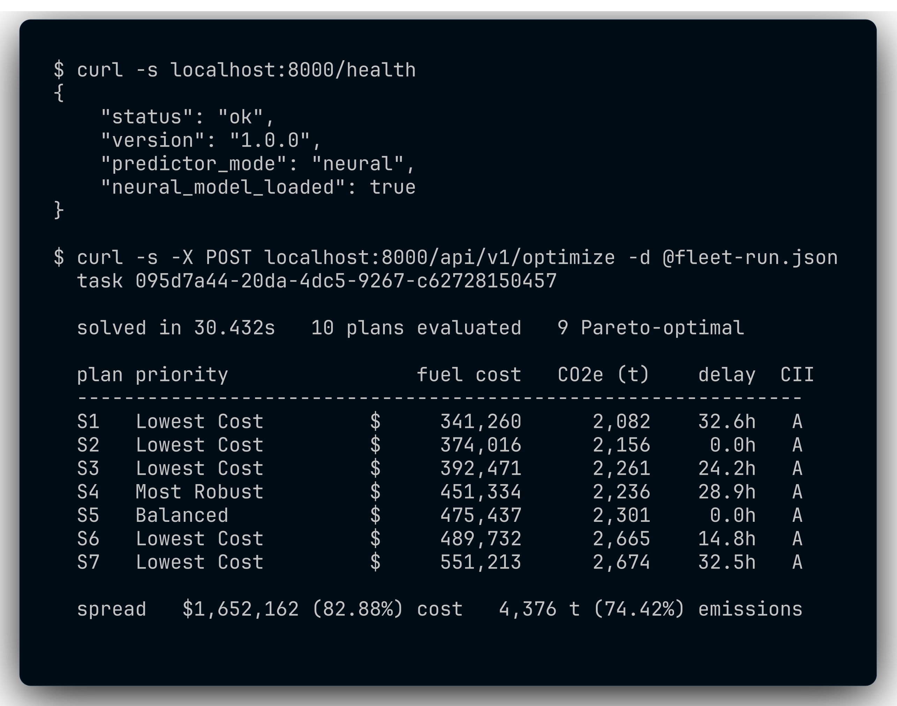
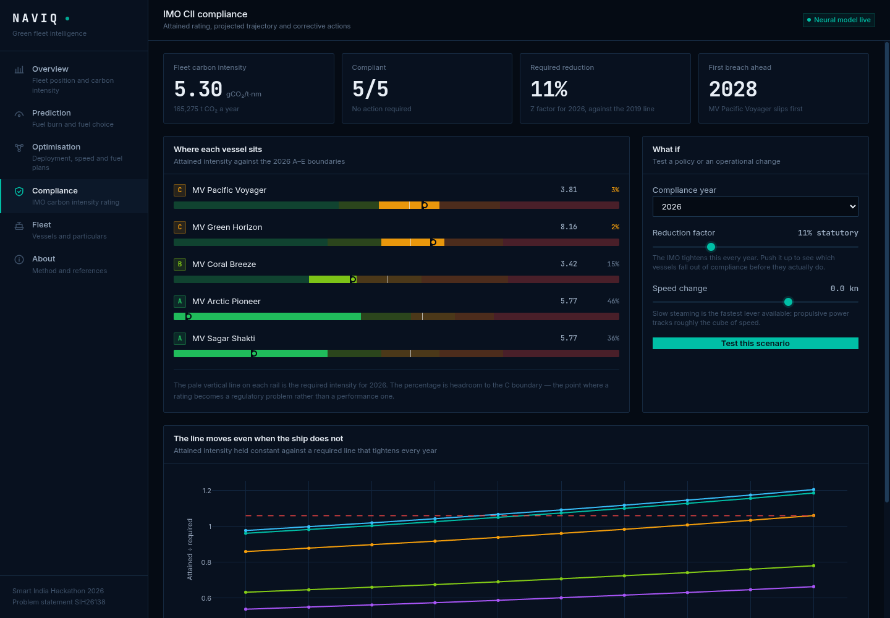
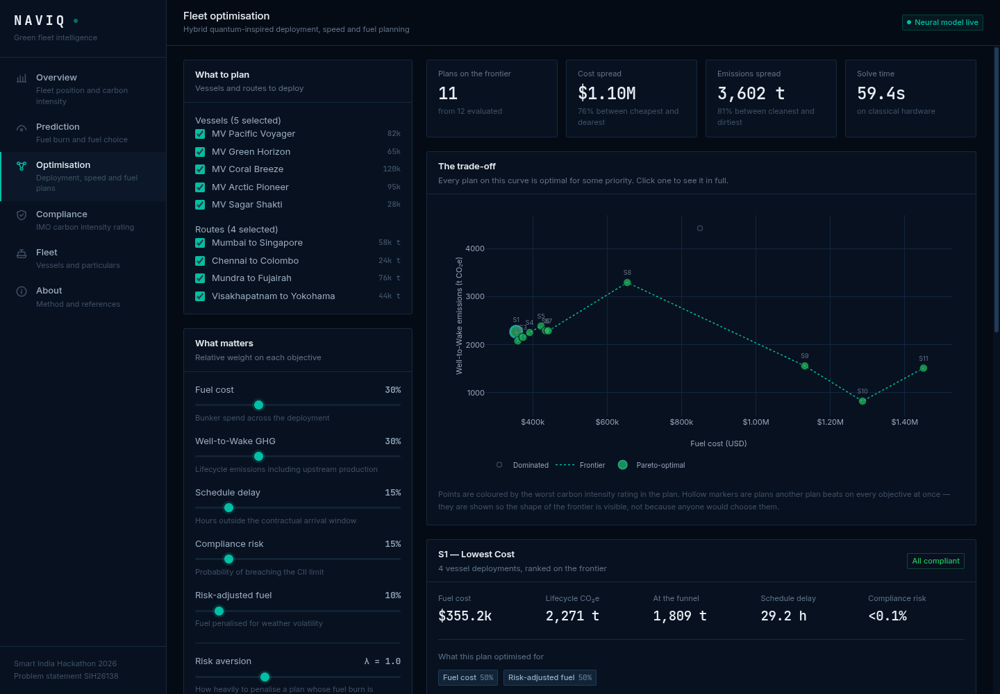
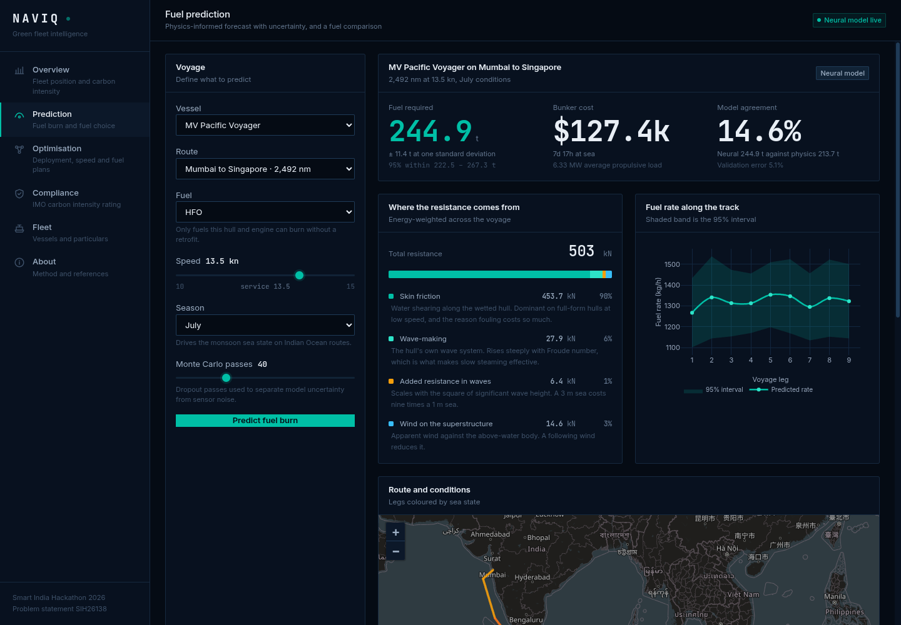

<div align="center">

# NAVIQ

### Quantum-Inspired Green Fleet Intelligence

**Predict** vessel fuel burn from physics and deep learning · **Optimise** fleet deployment with hybrid quantum-inspired solvers · **Guarantee** IMO carbon-intensity compliance as a hard constraint · **Compare** marine fuels across their full lifecycle

<br>

[](#verification)
[](#1-fuel-prediction)
[](#2-the-hybrid-optimiser)
[](#running-it)
[](LICENSE)

**Smart India Hackathon 2026** · Problem statement `SIH26138` · Clean &amp; Green Technology

</div>

---

<div align="center">
  
</div>

---

## The problem

From 2023 every cargo ship over 5,000 GT carries an IMO carbon-intensity rating from **A** to **E**. Rated **D** three years running, or **E** once, and the operator must file a corrective action plan before the vessel trades again.

The threshold tightens every year on a fixed schedule toward 2030. A ship rated C today drifts to D and then E **without anything about it changing** — the line moves underneath it.

Operators face three questions at once, and the existing tools answer them separately:

| Question | What the market offers | What it misses |
|---|---|---|
| How much fuel will this voyage burn? | Fuel-prediction platforms | Black-box ML that ignores physics on unseen weather |
| Which ship, route, fuel and speed? | Voyage-optimisation tools | One metaheuristic forced across discrete *and* continuous variables |
| Will we stay compliant? | CII reporting dashboards | Measured after the voyage, when it is too late to act |

Answer them independently and the answers conflict. NAVIQ solves them as one problem.

---

## What makes it different

<table>
<tr><td width="50%" valign="top">

#### Compliance is a constraint, not a report
`P(CII > limit) ≤ ε` sits **inside** the optimiser. Every plan returned is compliant before the ship leaves the berth — the constraint cannot be violated because infeasible plans never enter the search.

</td><td width="50%" valign="top">

#### Two solvers, each for what it is built for
Deployment is discrete (which ship, which fuel, shore power or not). Speed is continuous. NAVIQ uses **QUBO annealing** for the first and **quantum PSO** for the second, instead of forcing both through one framework.

</td></tr>
<tr><td width="50%" valign="top">

#### Emissions counted across the whole lifecycle
Grey ammonia burns **91% cleaner at the funnel** and emits **51% more overall**. Tank-to-wake reporting would recommend it. NAVIQ separates upstream from combustion and flags the gap automatically.

</td><td width="50%" valign="top">

#### Physics constrains the learning
The loss penalises violations of energy conservation and cubic speed scaling, so predictions stay physical on weather the network never trained on — where a purely data-driven model quietly fails.

</td></tr>
<tr><td width="50%" valign="top">

#### Uncertainty is a decision input
Minimises `E[F] + λ·σ(F)`. A route 5% better on average but wild in a storm loses to a steadier one. Monte Carlo Dropout separates *model ignorance* from *sensor noise*.

</td><td width="50%" valign="top">

#### Shore power is decided, not assumed
`z_shore ∈ {0,1}` is a real QUBO variable. Against a coal-heavy grid at 632 gCO₂/kWh the optimiser **declines to connect** — plugging in would raise emissions.

</td></tr>
</table>

> **Every algorithm computes.** No mocked responses, no hard-coded results, no placeholder returns. The verification below is reproducible from a clean checkout.

---

## Architecture

```
┌──────────────────────────────────────────────────────────────────────────┐
│  React 18 · TypeScript · Tailwind · Leaflet · Plotly · KaTeX             │
│                                                                          │
│   Overview     Prediction     Optimisation     Compliance     Fleet      │
│      │             │               │                │            │      │
└──────┼─────────────┼───────────────┼────────────────┼────────────┼──────┘
       │             │               │ WebSocket      │            │
       │             │               │ (live telemetry)            │
┌──────┴─────────────┴───────────────┴────────────────┴────────────┴──────┐
│  FastAPI · Pydantic validation · async task registry                     │
│  37 endpoints  ·  /ws/optimization/{id}  ·  SQLAlchemy → SQLite          │
└──────┬─────────────┬───────────────┬────────────────┬───────────────────┘
       │             │               │                │
┌──────┴──────┐ ┌────┴────────┐ ┌────┴──────────┐ ┌───┴──────────────┐
│  PHYSICS    │ │  PREDICTION │ │  OPTIMISATION │ │  COMPLIANCE      │
│             │ │             │ │               │ │                  │
│ Holtrop–    │ │ BiLSTM +    │ │ QUBO / SQA    │ │ CII per MEPC.353 │
│ Mennen      │→│ attention   │→│      ↓        │←│ AER, A–E bands   │
│ resistance  │ │ physics     │ │ QPSO speeds   │ │ SEEMP actions    │
│ propulsion  │ │ loss, MC    │ │      ↓        │ │                  │
│ fuel conv.  │ │ dropout     │ │ Pareto sort   │ │ Well-to-Wake     │
└─────────────┘ └─────────────┘ └───────────────┘ └──────────────────┘
```

### How one optimisation run flows

```
   fleet · routes · objective weights
                 │
                 ▼
  ┌──────────────────────────────┐   discrete decisions
  │  STAGE 1   QUBO              │   ── which vessel on which route
  │  Simulated quantum annealing │   ── which fuel
  │  Trotter replicas, tunnelling│   ── shore power at each port
  │  CII penalty inside Q        │
  └──────────────┬───────────────┘
                 │  assignments
                 ▼
  ┌──────────────────────────────┐   continuous decisions
  │  STAGE 2   QPSO              │   ── speed for every leg
  │  Delta-well sampling         │   ── weather-aware, ETA-bounded
  │  no velocity term            │
  └──────────────┬───────────────┘
                 │  speed profiles
                 ▼
      evaluate 5 objectives   ── fuel cost · lifecycle GHG
                 │                delay · compliance risk · risk-adjusted fuel
                 │  repeat across weight vectors
                 ▼
      NSGA-II non-dominated sort  ──▶  Pareto front
```

**Why two stages.** A single MILP must discretise speed into buckets and loses the true optimum between them. A single genetic algorithm spends most of its budget repairing constraint violations it keeps generating. Splitting the problem lets each solver work on the structure it was designed for — and the CII penalty lives in the QUBO matrix, so infeasible deployments are never explored.

---

## Verification

Claims below are produced by running the code, not asserted. Reproduce any of them from a clean checkout.

### The test suite



```bash
cd backend && .venv/bin/python -m pytest tests/ -q
```

### Both solvers, against provable ground truth

The QUBO solver is checked against **exhaustive search over all 2¹⁴ = 16,384 states** — the optimum is proven, not estimated. QPSO is held to published benchmarks, including Rastrigin, which reliably traps velocity-driven swarms.



### The prediction model

Trained under the physics-informed loss. **5.11% MAPE** against a naive `v³` baseline at 10.8% — the network halves the error of the obvious approach.



### The solvers running, in the browser

Temperature and transverse field decaying together across successive anneals, tunnelling
events counted as they happen, swarm diversity collapsing as the particles converge. These
curves are streamed over a WebSocket from the running solver — **they cannot be produced by a
mocked backend**.



### A live optimisation over the API

Five vessels, four routes, ten weight vectors — solved on a laptop CPU. Nine plans survive non-dominated sorting, spanning an **83% cost spread** and a **74% emissions spread**, every one CII-compliant.



### Summary

| Component | Implementation | Verified against |
|---|---|---|
| Fuel prediction | BiLSTM + time-aware attention, physics loss, MC-Dropout | **5.11% MAPE**, 73.8 kg/h MAE |
| Resistance | ITTC-1957 friction line, form factor, residuary, wind, waves | Engine loads **47–69% MCR** at service speed |
| Discrete optimisation | QUBO via path-integral simulated quantum annealing | **Global optimum**, exhaustive search over 2¹⁴ |
| Continuous optimisation | Quantum-behaved PSO, delta-well sampling | **0.0003** Rastrigin-5D · **1.3e-22** sphere-8D |
| Compliance | MEPC.353(78) lines, MEPC.354(78) bands, piecewise capacity | Realistic **A/A/B/C/C** fleet spread |
| Lifecycle emissions | WtT + TtW, CH₄ slip at GWP100, negative WtT for e-fuels | Grey NH₃: **−91% funnel, +51% lifecycle** |

---

## The interface

<table>
<tr>
<td width="50%"></td>
<td width="50%" valign="top">

### Compliance

Each vessel's attained intensity plotted against the **real MEPC boundaries**, so the margin — the number that decides whether next year is a problem — is the visible quantity, not a letter in a box.

The trajectory chart carries the central argument: plotted as attained ÷ required, **every curve climbs toward the limit** with no operational change at all, because the denominator shrinks each year.

</td>
</tr>
<tr>
<td width="50%" valign="top">

### Optimisation

Live solver telemetry over WebSocket: temperature and transverse field decaying together, acceptance falling as the system freezes, swarm diversity collapsing as it converges. **These signatures only appear if the computation is real.**

The Pareto front is clickable down to per-leg speed profiles, fuel selections and shore-power decisions. Dominated plans stay visible in outline so the frontier reads as a frontier.

</td>
<td width="50%"></td>
</tr>
<tr>
<td width="50%"></td>
<td width="50%" valign="top">

### Prediction

A fuel figure with its **95% interval**, the resistance decomposition behind it, and every alternative fuel costed on the same voyage.

The fuel matrix puts funnel emissions beside lifecycle emissions and flags the gap — which is how **grey ammonia gets caught** looking clean while emitting more than the fuel it replaces.

</td>
</tr>
</table>

---

## Running it

Two commands. No PostgreSQL, no Redis, no Celery — demo mode is SQLite plus an in-process task runner, so the stack starts cold.

### Backend

```bash
cd backend
python -m venv .venv && source .venv/bin/activate
pip install -r requirements.txt
pip install torch --index-url https://download.pytorch.org/whl/cpu

uvicorn app.main:app --reload --port 8000
```

Interactive API docs at **http://localhost:8000/docs**

### Frontend

```bash
cd frontend
npm install
npm run dev
```

Open **http://localhost:5173** — Vite proxies `/api` and `/ws` to port 8000.

### Docker

```bash
docker compose up --build
```

### Retraining the model

Weights ship in the repository, so nothing needs training to run the demo.

```bash
cd backend
python -m app.core.prediction.train --epochs 80 --voyages 800   # ~60s on CPU
```

Without weights the service falls back to the analytic physics predictor and stays fully functional.

---

## The mathematics

<table>
<tr><th align="left" width="34%">Prediction</th><th align="left">&nbsp;</th></tr>
<tr><td><code>ŷ = f<sub>θ</sub>(X, S, W)</code></td><td>BiLSTM with time-aware self-attention over speed, draft, power, weather</td></tr>
<tr><td><code>L = L<sub>data</sub> + λ<sub>phys</sub>L<sub>phys</sub></code></td><td>Data fit plus penalties for breaking energy conservation and cubic scaling</td></tr>
<tr><td><code>σ²<sub>tot</sub> = σ²<sub>epi</sub> + σ²<sub>alea</sub></code></td><td>Model ignorance from MC Dropout; sensor noise from a learned variance head</td></tr>
<tr><th align="left">Physics</th><th align="left">&nbsp;</th></tr>
<tr><td><code>R<sub>total</sub> = R<sub>calm</sub> + R<sub>wind</sub> + R<sub>wave</sub></code></td><td>Simplified Holtrop–Mennen decomposition</td></tr>
<tr><td><code>C<sub>F</sub> = 0.075 / (log₁₀Re − 2)²</code></td><td>ITTC-1957 correlation line, scaled by a hull form factor</td></tr>
<tr><td><code>P<sub>shaft</sub> = R·V / η<sub>D</sub> · (1 + SM)</code></td><td>Quasi-propulsive efficiency with a 15% sea margin</td></tr>
<tr><th align="left">Optimisation</th><th align="left">&nbsp;</th></tr>
<tr><td><code>min x<sup>T</sup>Qx, x ∈ {0,1}<sup>n</sup></code></td><td>Deployment, fuel selection and shore power</td></tr>
<tr><td><code>J<sub>⊥</sub> = −(P/2β)·ln tanh(βΓ/P)</code></td><td>Trotter coupling — weak at high Γ, stiff as it decays</td></tr>
<tr><td><code>x<sub>i</sub> = p<sub>i</sub> ± α|m<sub>best</sub> − x<sub>i</sub>|·ln(1/u)</code></td><td>Quantum delta-well sampling; unbounded, so the swarm cannot be trapped</td></tr>
<tr><th align="left">Compliance</th><th align="left">&nbsp;</th></tr>
<tr><td><code>AER = CO₂ / (DWT × D)</code></td><td>Grams of CO₂ per tonne-nautical-mile</td></tr>
<tr><td><code>CII<sub>req</sub> = a·Cap<sup>−c</sup>·(1 − Z/100)</code></td><td>Reference line tightened by the annual reduction factor</td></tr>
<tr><td><code>P(CII &gt; limit) ≤ ε</code></td><td><b>Enforced inside the optimiser</b>, not checked afterwards</td></tr>
<tr><th align="left">Emissions</th><th align="left">&nbsp;</th></tr>
<tr><td><code>m<sub>f</sub> = E<sub>prop</sub> / (LHV<sub>f</sub>·η<sub>f</sub>)</code></td><td>Energy-based conversion; mass differs sharply between fuels</td></tr>
<tr><td><code>GHG<sub>WtW</sub> = GHG<sub>WtT</sub> + GHG<sub>TtW</sub></code></td><td>Upstream production plus combustion</td></tr>
<tr><td><code>F<sub>risk</sub> = E[F] + λ·σ(F)</code></td><td>Penalises plans whose fuel burn is volatile under uncertain weather</td></tr>
</table>

Rendered with KaTeX in a collapsible panel on every page: an operator wants the answer, a reviewer wants the derivation, and neither should obstruct the other.

---

## Repository layout

```
backend/
├── app/
│   ├── core/
│   │   ├── physics/         resistance · propulsion · fuel_conversion · weather
│   │   ├── prediction/      model · physics_loss · data_processor · predictor · train
│   │   ├── optimization/    qubo_solver · qpso_solver · hybrid_optimizer
│   │   │                    objectives · constraints
│   │   ├── compliance/      cii_calculator · imo_rules · seemp
│   │   └── emissions/       wtw_calculator · shore_power
│   ├── api/
│   │   ├── routes/          vessels · voyages · prediction · optimization
│   │   │                    compliance · fuel_comparison · dashboard
│   │   └── websocket.py     live solver telemetry
│   ├── models/              SQLAlchemy ORM
│   ├── schemas/             Pydantic validation
│   └── data/                fuel database · IMO CII tables · fleet · routes
│                            ports · trained model weights
└── tests/                   83 tests: physics · solvers · compliance · API

frontend/src/
├── pages/                   Overview · Prediction · Optimisation
│                            Compliance · Fleet · About
├── components/              layout · common · prediction · optimization · compliance
├── hooks/                   useWebSocket · useOptimization · usePrediction
└── services/api.ts          typed API client
```

---

## Data provenance

Everything traces to a published source. Nothing was invented for the demo.

| Data | Source |
|---|---|
| Fuel properties, carbon factors | IMO MEPC.364(79) · MEPC.1/Circ.905 LCA guidelines |
| Well-to-Tank intensities | EU FuelEU Maritime (EU) 2023/1805 Annex II |
| CH₄ and N₂O warming potentials | IPCC AR6 GWP100 |
| CII reference lines | IMO MEPC.353(78) |
| CII rating boundaries, reduction factors | IMO MEPC.354(78) · MEPC.338(76) |
| Shore power availability | IAPH World Ports Sustainability Program · EU AFIR Art. 9 · IPA Harit Sagar |

**Routes** follow real navigable sea lanes; leg distances come from waypoint geodesics, so the map and the fuel figures reconcile rather than being stated independently.

**Weather** is synthesised with monsoon seasonality and spatial correlation — the structure the optimiser reacts to is faithful, so routing decisions match what real forecasts drive. Swap `core/physics/weather.py` for a NOAA GFS or Copernicus CMEMS feed in production; the interface is stable.

---

## References

- **Kadowaki &amp; Nishimori** (1998) — Quantum annealing in the transverse Ising model · *Phys. Rev. E 58*
- **Martoňák, Santoro &amp; Tosatti** (2002) — Quantum annealing by path-integral Monte Carlo · *Phys. Rev. B 66*
- **Sun, Feng &amp; Xu** (2004) — Particle swarm optimization with particles having quantum behavior · *IEEE CEC*
- **Holtrop &amp; Mennen** (1982) — An approximate power prediction method · *Int. Shipbuilding Progress 29*
- **Deb et al.** (2002) — A fast and elitist multiobjective genetic algorithm: NSGA-II · *IEEE Trans. Evol. Comput. 6*
- **Gal &amp; Ghahramani** (2016) — Dropout as a Bayesian approximation · *ICML*
- **Raissi, Perdikaris &amp; Karniadakis** (2019) — Physics-informed neural networks · *J. Comput. Phys. 378*

---

<div align="center">

Built for **Smart India Hackathon 2026** · Problem statement `SIH26138`

Licensed under [Apache 2.0](LICENSE)

</div>
